:::tip
在两台服务器上安装k8s服务
:::

<!-- more -->
[[toc]]

## 1. 系统准备
### 1.1 系统需求
需要至少2台机器, 并且操作系统为```CentOS``` 7.8
| IP | hostname|
| :----: | :----: |
|192.168.10.4| master|
|192.168.10.5| slave|
除非特意指明, 否则所以命令都需要在两台机器上执行.
>注: 安装的为单master节点Kubernetes集群


### 1.2 系统更新
系统更新
```bash
yum update -y
```
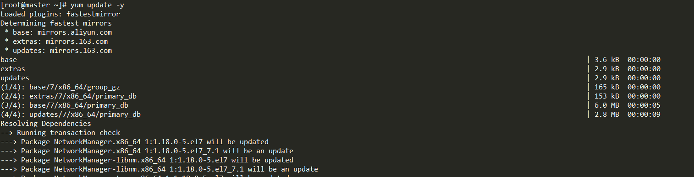

配置```host```
```bash
cat >> /etc/hosts <<EOF
192.168.10.4 master
192.168.10.5 slave
EOF
```

## 2. 系统配置
### 2.1 关闭```SELinux```
关闭```SELinux```
```bash
setenforce 0
sed -i 's/^SELINUX=enforcing$/SELINUX=disabled/' /etc/selinux/config
```

关闭```SELinux```后```/etc/selinux/config```
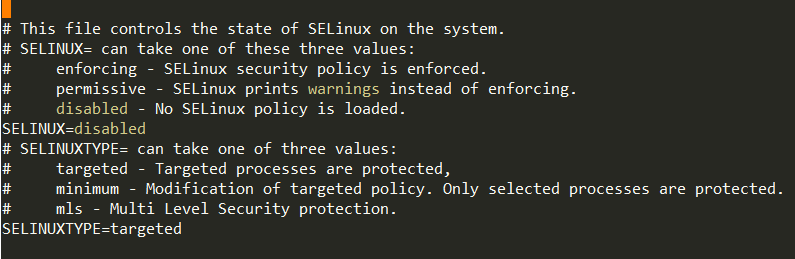

### 2.2 关闭```swap```空间
查看是否有```swap```空间
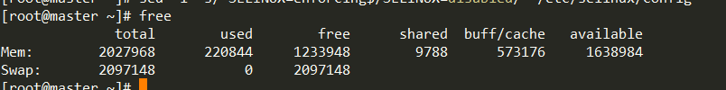
删除```/etc/fstab```
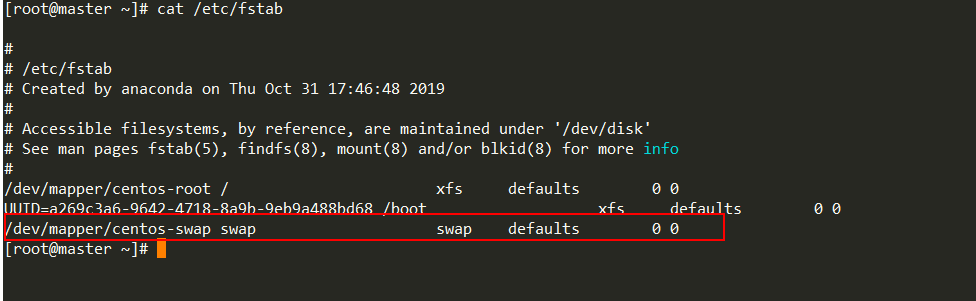
关闭swap
```bash
swapoff -a
free
```
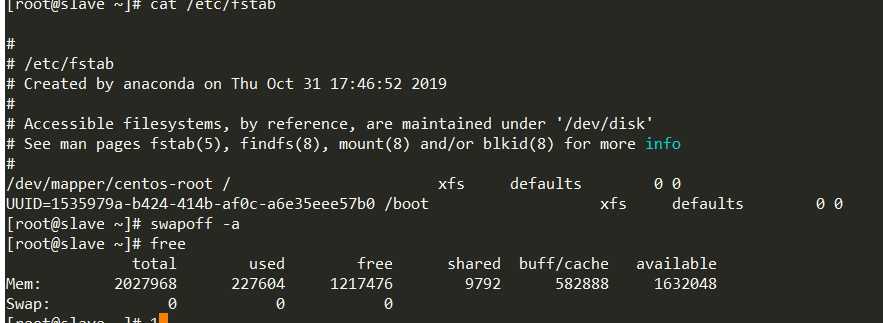

### 2.3 流量传递到```iptable```
```bash
cat > /etc/sysctl.d/k8s.conf << EOF
net.bridge.bridge-nf-call-ip6tables = 1
net.bridge.bridge-nf-call-iptables = 1
EOF
sysctl --system
```

### 2.4 关闭防火墙
关闭防火墙
```bash
service firewalld stop
systemctl disable firewalld
```
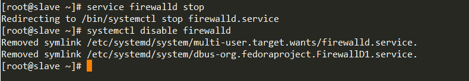

### 2.5 修改文件句柄
```bash
echo "* soft nofile 65536" >> /etc/security/limits.conf
echo "* hard nofile 65536" >> /etc/security/limits.conf
echo "* soft nproc 65536"  >> /etc/security/limits.conf
echo "* hard nproc 65536"  >> /etc/security/limits.conf
echo "* soft  memlock  unlimited"  >> /etc/security/limits.conf
echo "* hard memlock  unlimited"  >> /etc/security/limits.conf
```

## 3. Kubernetes安装
### 3.1 配置阿里云```yum```源
```bash
cat > /etc/yum.repos.d/kubernetes.repo << EOF
[kubernetes]
name=Kubernetes
baseurl=https://mirrors.aliyun.com/kubernetes/yum/repos/kubernetes-el7-x86_64
enabled=1
gpgcheck=1
repo_gpgcheck=1
gpgkey=https://mirrors.aliyun.com/kubernetes/yum/doc/yum-key.gpg
https://mirrors.aliyun.com/kubernetes/yum/doc/rpm-package-key.gpg
EOF

yum install -y wget
wget https://mirrors.aliyun.com/kubernetes/yum/doc/yum-key.gpg
rpm --import yum-key.gpg
wget https://mirrors.aliyun.com/kubernetes/yum/doc/rpm-package-key.gpg
rpm --import rpm-package-key.gpg
```
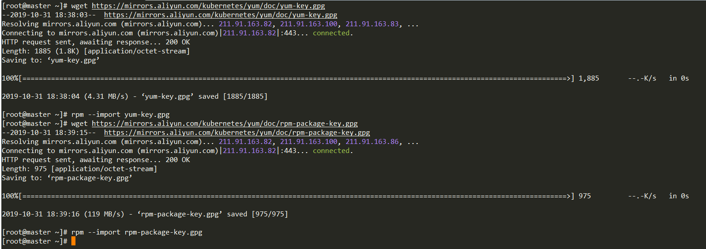

### 3.2 安装
```bash
yum install -y docker kubelet kubeadm kubectl
systemctl enable docker kubelet
systemctl daemon-reload
systemctl restart docker.service
```
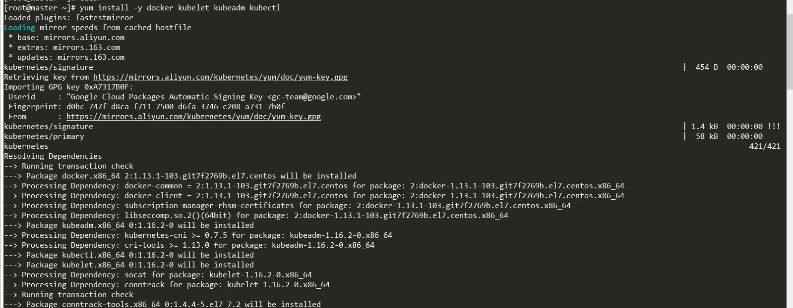

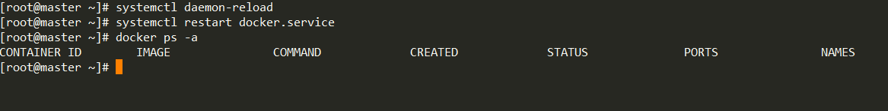

### 3.3 Master机器上下载镜像, 并使用flannel网络设置
> Master机器执行
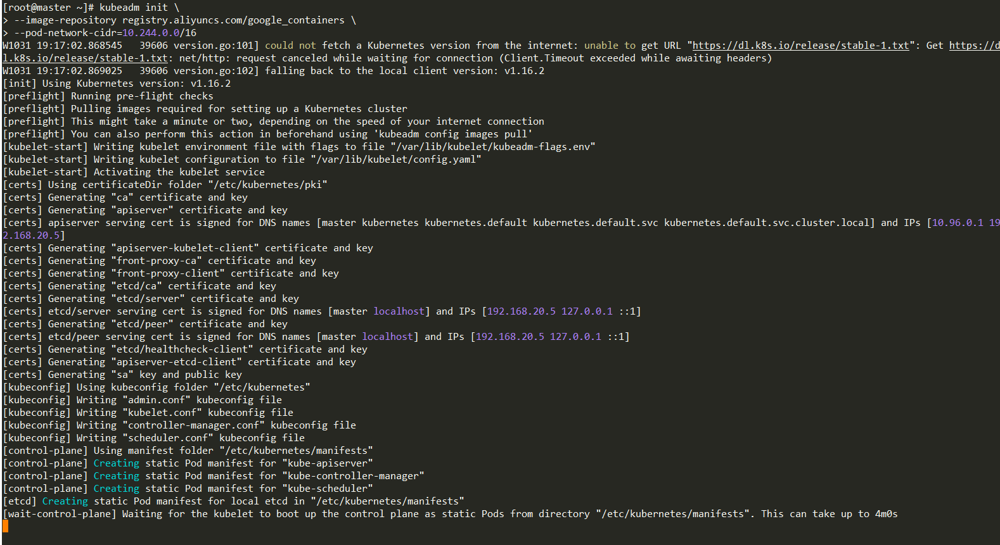
```bash
kubeadm init \
--image-repository registry.aliyuncs.com/google_containers \
--pod-network-cidr=10.244.0.0/16
```

```bash
mkdir -p $HOME/.kube
cp -i /etc/kubernetes/admin.conf $HOME/.kube/config
chown $(id -u):$(id -g) $HOME/.kube/config
```
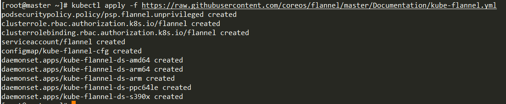
```bash
kubectl apply -f https://raw.githubusercontent.com/coreos/flannel/master/Documentation/kube-flannel.yml
```

### 3.4 Slave机器连接master
> Slave机器执行
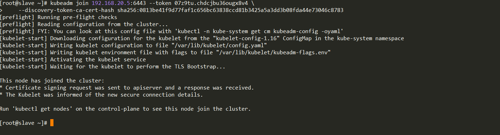
```bash
kubeadm join 192.168.20.5:6443 --token 07z9tu.chdcjbu36ougx8v4 \
    --discovery-token-ca-cert-hash sha256:0813be41f9d77faf1c656bc63838ccd81b3425a5a3dd3b08fda44e73046c8783
```

### 3.5 查看slave连接状态
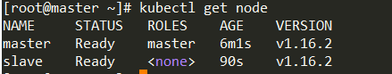
```bash
kubectl get node
```

## 4. 安装Kubernetes-dashboard
### 4.1 安装命令
> Master机器执行
```bash
wget https://raw.githubusercontent.com/kubernetes/dashboard/v2.0.1/aio/deploy/recommended.yaml
```
修改```kubernetes-dashboard```用户权限
```yml {8}
apiVersion: rbac.authorization.k8s.io/v1
kind: ClusterRoleBinding
metadata:
  name: kubernetes-dashboard
roleRef:
  apiGroup: rbac.authorization.k8s.io
  kind: ClusterRole
  name: cluster-admin
subjects:
  - kind: ServiceAccount
    name: kubernetes-dashboard
    namespace: kubernetes-dashboard
```

### 4.2 获取web token
> Master机器执行
```bash
kubectl -n kubernetes-dashboard describe secret $(kubectl -n kubernetes-dashboard get secret | grep kubernetes-dashboard-token | awk '{print $1}')
```

## 5. 安装kubectl自动补全
### 5.1 安装```bash-completion```
```bash
yum install bash-completion -y
```
重启shell后, 使用命令```type _init_completion```测试是否安装成功

### 5.2 ```~/.bashrc```文件中获取完成脚本
```bash
echo 'source <(kubectl completion bash)' >>~/.bashrc
```

### 5.3 将完成脚本添加到```/etc/bash_completion.d```目录
```bash
kubectl completion bash >/etc/bash_completion.d/kubectl
echo 'alias k=kubectl' >>~/.bashrc
echo 'complete -F __start_kubectl k' >>~/.bashrc
```