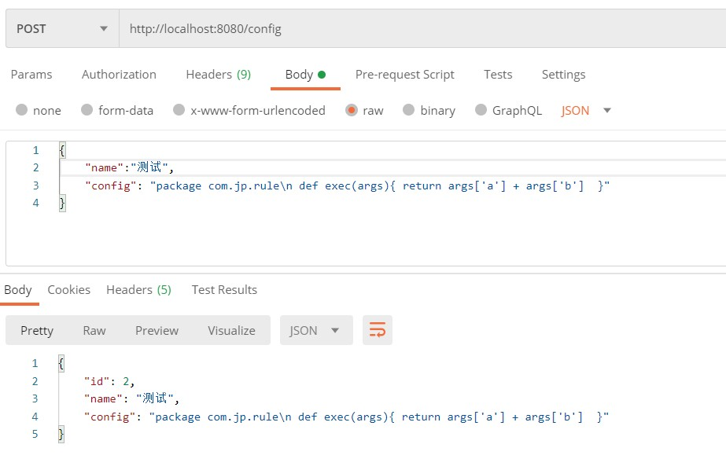
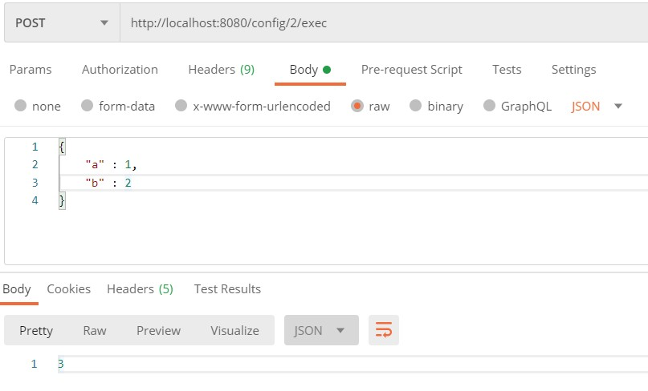
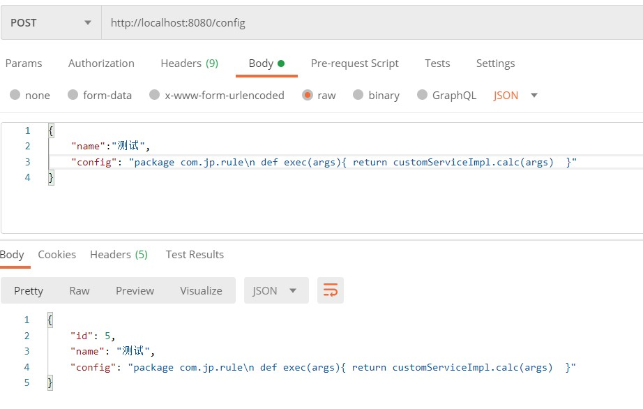
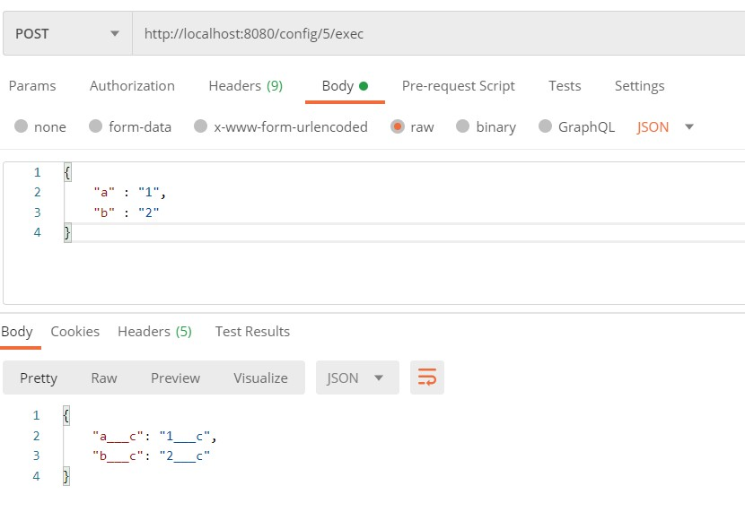

:::tip
groovy算是java的动态脚本. 规则可以通过groovy脚本动态执行. 而且最方便对的是. 代码可以调用Spring bean. 可以把计算结果直接保存, 更新.
:::

<!-- more -->
[[toc]]
## 1. Springboot maven集成groovy
```xml
        <dependency>
            <groupId>org.codehaus.groovy</groupId>
            <artifactId>groovy-all</artifactId>
            <version>3.0.7</version>
            <type>pom</type>
        </dependency>
```

## 2. 添加groovy配置
```java
import groovy.lang.Binding;
import groovy.lang.GroovyClassLoader;
import groovy.lang.GroovyShell;
import org.codehaus.groovy.control.CompilerConfiguration;
import org.springframework.beans.BeansException;
import org.springframework.context.ApplicationContext;
import org.springframework.context.ApplicationContextAware;
import org.springframework.context.annotation.Bean;
import org.springframework.context.annotation.Configuration;

import java.util.Map;

@Configuration(proxyBeanMethods = false)
public class GroovyConfiguration implements ApplicationContextAware {

    private ApplicationContext applicationContext;

    @Bean
    public Binding groovyBinding(){
        // 获取所有注册的 bean
        Map<String, Object> beanMaps = applicationContext.getBeansOfType(Object.class);
        // 添加到groovy 绑定上下文中
        return new Binding(beanMaps);
    }

    @Bean
    public GroovyShell groovyShell(Binding binding){
        // 获取groovy类加载器
        GroovyClassLoader groovyClassLoader = new GroovyClassLoader(this.getClass().getClassLoader());
        // 设置配置
        CompilerConfiguration compilerConfiguration = new CompilerConfiguration();
        compilerConfiguration.setSourceEncoding("utf-8");
        // 设置groovy 执行shell
        return new GroovyShell(groovyClassLoader, binding, compilerConfiguration);
    }

    @Override
    public void setApplicationContext(ApplicationContext applicationContext) throws BeansException {
        this.applicationContext = applicationContext;
    }
}

```

## 3. 配置保存类
```java
import lombok.Data;
import org.hibernate.annotations.Type;

import javax.persistence.*;

@Data
@Entity
@Table(name = "t_config")
public class Config {

    @Id
    @GeneratedValue(strategy= GenerationType.TABLE)
    private Long id;

    @Column
    private String name;

    @Column
    @Type(type = "text")
    private String config;
}
```

## 4. 配置接口
```java
import com.example.demo.dao.ConfigRepository;
import com.example.demo.model.Config;
import groovy.lang.GroovyShell;
import groovy.lang.Script;
import lombok.RequiredArgsConstructor;
import org.springframework.http.ResponseEntity;
import org.springframework.util.StringUtils;
import org.springframework.web.bind.annotation.*;

import java.util.Map;
import java.util.Objects;
import java.util.Optional;
import java.util.concurrent.ConcurrentHashMap;

@RequiredArgsConstructor
@RestController
@RequestMapping("/config")
public class ConfigController {

    private static final Map<Long, Script> CONFIG_SCRIPT_MAP = new ConcurrentHashMap<>();
    private final ConfigRepository repository;
    private final GroovyShell groovyShell;

    @GetMapping("/{id}")
    public ResponseEntity<Config> get(@PathVariable("id") Long id) {
        Optional<Config> optionalConfig = repository.findById(id);
        return ResponseEntity.of(optionalConfig);
    }

    @PostMapping("")
    public ResponseEntity<Config> post(@RequestBody Config config) {
        Config config1 = repository.save(config);
        // 保存时, 解析脚本保存到内存. (解析脚本是个特别费时的操作)
        CONFIG_SCRIPT_MAP.put(config1.getId(), groovyShell.parse(config.getConfig()));
        return ResponseEntity.ok(config1);
    }

    @DeleteMapping("/{id}")
    public ResponseEntity<String> delete(@PathVariable("id") Long id) {
        repository.deleteById(id);
        CONFIG_SCRIPT_MAP.forEach((configId, script) -> {
            if (Objects.equals(configId, id)) {
                // 删除配置时, classloader清除缓存, 防止fullgc
                // see: https://blog.csdn.net/chengbinbbs/article/details/86721959
                groovyShell.getClassLoader().clearCache();
            }
        });
        return ResponseEntity.ok("success");
    }

    @PostMapping("/{id}/exec")
    public ResponseEntity<Object> exec(@PathVariable("id") Long id, @RequestBody Map<String, Object> args) {
        Optional<Config> optionalConfig = repository.findById(id);
        if (!optionalConfig.isPresent() || !StringUtils.hasText(optionalConfig.get().getConfig())) {
            throw new RuntimeException("配置不存在");
        }
        Script script = CONFIG_SCRIPT_MAP.get(id);
        // 执行脚本
        return ResponseEntity.ok(script.invokeMethod("exec", args));
    }

}

```

## 5. 测试直接调用
```groovy
package com.test.rule 

def exec(args){ 
    return args['a'] + args['b']
}
```






## 6. 调用spring bean方法

groovy代码: 
```groovy
package com.test.rule
import com.test.service.ICustomService 

def exec(args){ 
    return customServiceImpl.calc(args)  
}
```

java代码:
```java
import org.springframework.stereotype.Component;

import java.util.HashMap;
import java.util.Map;
import java.util.Objects;

@Component
public class CustomServiceImpl implements ICustomService {
    @Override
    public Map<String, String> calc(Map<String, String> args) {
        if (Objects.isNull(args)) {
            return new HashMap<>(0);
        }
        Map<String, String> result = new HashMap<>(args.size());
        args.forEach((k, v) -> {
            result.put(k + "___c", v + "___c");
        });
        return result;
    }
}
```



